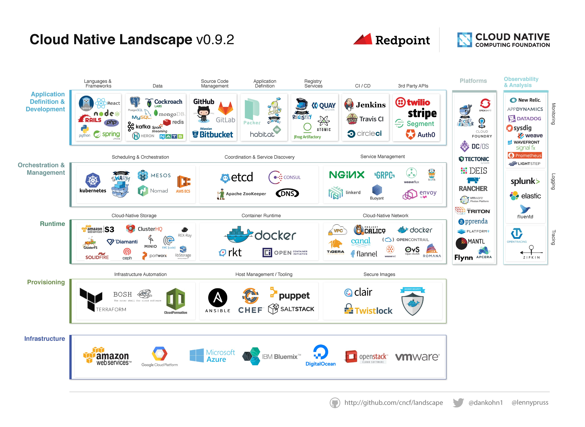

# Cloud Native Landscape document

This is version 0.9.2 of the [CNCF](https://www.cncf.io) Cloud Native Landscape
Project, which attempts to categorize many of the most popular projects and
startups in the cloud native space.

Suggestions for improvements are welcome. Please open an issue.

## Current Version

The current version of the landscape is 0.9.2. It is available as:

* [JPEG](landscape/CloudNativeLandscape_v0.9.2.jpg)
* [PDF](landscape/CloudNativeLandscape_v0.9.2.pdf)
* [Adobe Illustrator](landscape/CloudNativeLandscape_v0.9.2.ai)

## License

The content of this project is licensed under the [Creative Commons Attribution 4.0 license](https://creativecommons.org/licenses/by/4.0/) and any source code used to format and display that content is licensed under the [Apache license](LICENSE).