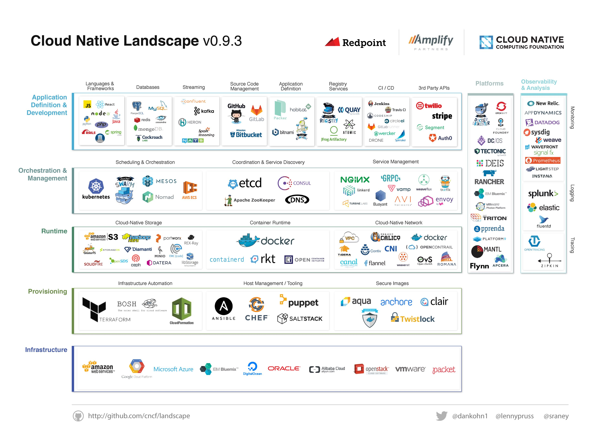

# Cloud Native Landscape Project

The [CNCF](https://www.cncf.io) Cloud Native Landscape
Project attempts to categorize many of the most popular projects and
startups in the cloud native space. It is under development by
[CNCF](https://www.cncf.io) and [Redpoint](https://www.redpoint.com/).

Suggestions for improvements are welcome. Please open an
[issue](https://github.com/cncf/landscape/issues/new).

## Current Version

## Formats

The current version of the landscape is 0.9.3. It is available in these formats:

* [JPEG](landscape/CloudNativeLandscape_v0.9.3.jpg)
* [PDF](landscape/CloudNativeLandscape_v0.9.3.pdf)
* [Adobe Illustrator](landscape/CloudNativeLandscape_v0.9.3.ai)

## License

The content of this project is licensed under the
[Creative Commons Attribution 4.0 license](https://creativecommons.org/licenses/by/4.0/)
and any source code used to format and display that content is licensed under
the [Apache license](LICENSE).