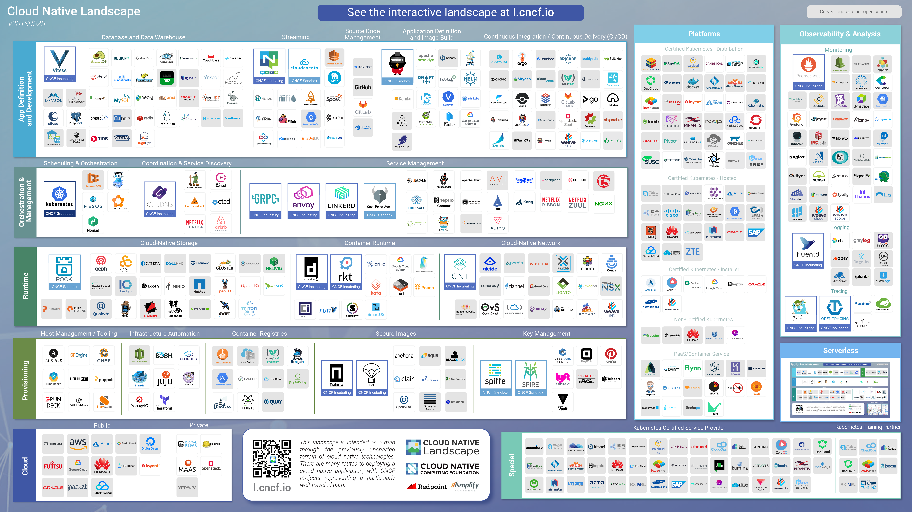
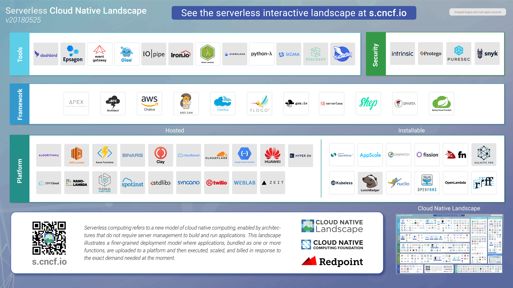

# Cloud Native Landscape

[![Cloud Native Landscape Logo]](https://raw.githubusercontent.com/cncf/artwork/master/other/cncf-landscape/horizontal/color/cncf-landscape-horizontal-color.png)(https://raw.githubusercontent.com/cncf/artwork/master/other/cncf-landscape/horizontal/color/cncf-landscape-horizontal-color.png)

The [CNCF](https://www.cncf.io) Cloud Native Landscape Project is intended as a map through the previously uncharted terrain of cloud native technologies. This attempts to categorize most of the projects and product offerings in the cloud native space. There are many routes to deploying a cloud native application, with CNCF Projects representing a particularly well-traveled path.

## Trail Map

The (soon-to-be-released) Cloud Native Trail Map provides an overview for enterprises starting their cloud native journey.

## Current Version

## Interactive Version

*** Coming soon ***

## Serverless

## New Entries

* We generally will only list a company's product in one box, to represent its major or best known offering. We occasionally make exceptions for large companies.
* Projects with at least 250 GitHub stars that clearly fit in an existing category are generally included.
* We are unlikely to create a new category for products/projects as we'd rather find the best home with the current options.
* We are generally not including commercial versions of open source software. The exception is that we are showing all Certified Kubernetes and non-Certified Kubernetes implementations.
* Closed source products need to link to a clear description of your product; no stealth mode companies.
* Your project or company needs a logo and the logo needs to include the name.

If you think your company or project should be included, please open a pull request to add it to [landscape.yml](landscape.yml). Netlify will generate a staging server for you to preview your updates. Please check that the logo and information appeards correctly and then add a comment to the PR confirming your review and requesting a merge.

## External Data

The canonical source for all data is [landscape.yml](landscape.yml). Once a day, we download data for projects and companies from the following sources:

* Project info from GitHub
* Funding info from [Crunchbase](https://www.crunchbase.com/)
* Market cap data from Yahoo Finance

The update server enhances the source data with the fetched data and saves the result in [processed_landscape.yml](processed_landscape.yml) and as a JSON [file](https://github.com/cncf/filterable-landscape/blob/master/src/data.json), which is what the app loads to display data.

## Corrections

Please open a pull request with edits to [landscape.yml](landscape.yml). The file [processed_landscape.yml](processed_landscape.yml) is generated and so should never be edited directly.

If the error is with data from [Crunchbase](https://www.crunchbase.com/) you should open an account there and edit the data. If you don't like a project description, edit it in GitHub. If your project isn't showing the license correctly, you may need to paste the unmodified text of the license into a LICENSE file at the root of your project in GitHub, in order for GitHub to serve the license information correctly.

## License

This repository contains data received from [Crunchbase](http://www.crunchbase.com). This data is not licensed pursuant to the Apache License, Version 2.0. It is subject to Crunchbase’s Data Access Terms, available at [https://data.crunchbase.com/v3.1/docs/terms](https://data.crunchbase.com/v3.1/docs/terms), and is only permitted to be used with this CNCF Cloud Native Landscape Project.

Everything else is under the Apache License, Version 2.0, except for project and product logos, which are generally copyrighted by the company that created them, and are simply cached here for reliability. The static landscape, serverless landscape, and [landscape.yml](landscape.yml) file are alternatively available under the [Creative Commons Attribution 4.0 license](https://creativecommons.org/licenses/by/4.0/).

## Formats

The CNCF Cloud Native Landscape is available in these formats:

* [PNG](landscape/CloudNativeLandscape_latest.png)
* [PDF](landscape/CloudNativeLandscape_latest.pdf)
* [Adobe Illustrator](landscape/CloudNativeLandscape_latest.ai)

The CNCF Serverless Lanscape is available in the same formats:

* [PNG](serverless/CloudNativeLandscape_Serverless_latest.png)
* [PDF](serverless/CloudNativeLandscape_Serverless_latest.pdf)
* [Adobe Illustrator](serverless/CloudNativeLandscape_Serverless_latest.ai)

## Logos

The following rules will produce the most readable and attractive logos:

1. We strongly prefer SVG, as they are smaller, display correctly at any scale, and work on all modern browsers. If you only have the logo in another vector format (like AI, EPS, or PSD), please open an issue and we'll convert it to SVG for you.
1. If it must be a PNG, the dimensions of the source logo must be at least 540x360, as that is what they are resized to. A transparent background is better; white will be converted to a transparent background.
1. When multiple variants exist, use stacked (not horizontal) logos. For example, we use the second column (stacked), not the first (horizontal), of CNCF project [logos](https://github.com/cncf/artwork/#cncf-incubating-logos).
1. Don't use reversed logos (i.e., with a non-white, non-transparent background color). If you only have a reversed logo, create an issue with it attached and we'll produce a non-reversed version for you.
1. Logos must include the company, product or project name in English. It's fine to also include words from another language. If you don't have a version of your logo with the name in it, please open an issue and we'll create one for you (and please specify the font).
1. Match the item name to the English words in the logos. So an Acme Rocket logo that shows "Rocket" should have product name "Rocket", while if the logo shows "Acme Rocket", the product name should be "Acme Rocket". Otherwise, logos looks out of place when you sort alphabetically.
1. Google images is often the best way to find a good version of the logo (but ensure it's the up-to-date version). Search for [project-name logo filetype:svg]. You can then change SVG files to PNG if you can't find a suitable SVG. When looking for PNGs click Tools, More Tools, and then Show Sizes or click this [image search link](https://www.google.com/search?q=kubernetes&tbs=ift:svg,imgo:1&tbm=isch) and change the search query.

## Installation

You can install and run locally with the [install directions](INSTALL.md). It's not necessary to install locally if you just want to edit [landscape.yml](landscape.yml). You can do so via the GitHub web interface.
