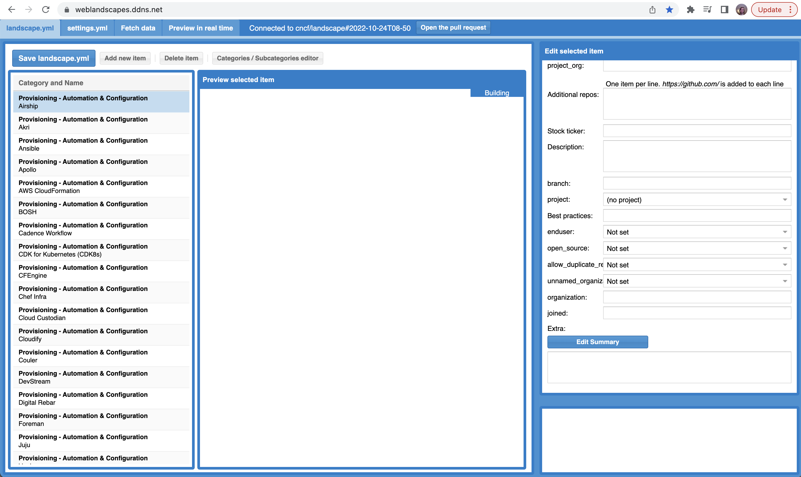
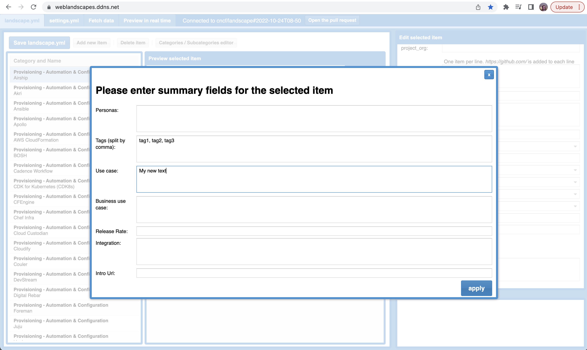

# How to update the Project Summary Table

These are instructions to update your project's information on the [Project Summary Table](https://landscape.cncf.io/summary). Please note: to update the information, you have to be a project owner, project maintainer, or have some type of strong project affiliation. 

The Project Summary Table is automatically generated out of the same underlying [landscape.yml](https://github.com/cncf/landscape/blob/master/landscape.yml) used for the CNCF Landscape.
As such, all updates are done via pull requests. There are two ways you can do this:

1. Use the GitHub web UI or your own tooling to create a branch and raise a PR against landscape.yml in the cncf/landscape repo

2. Use the recently developed landscape web UI. This UI automatically creates a branch, formats landscape.yml, and even helps create a pull request.

## Using your own tooling:

These are the fields used for the landscape. They are all located in the *extra:* section for your project entry: 


```
extra: 
  summary_personas
  summary_tags
  summary_use_case
  summary_business_use_case
  summary_release_rate
  summary_integrations
  summary_intro_url
``` 

If you are familiar with raising a pull request against the Landscape, you can simply follow the same process to update the additional fields used by the summary table.

## Using the Web Landscapes UI

- Navigate to weblandscapes.ddns.net
- Confirm that “cncf/landscape” is selected in the Repostitory field. Then create your own branch name or accept the default name proposed, and press the "connect" button.


- Choose the item in the list on the left (e.g., Airship), and scroll the right panel to the bottom:


- Press "Edit Summary" button and add in the relevant information:


- Press "Apply"
- Press "Save landscape.yml" (top left).  This will create the new branch in the landscape/cncf repo and make a new commit with your changes.


- Press "Create the pull request" button in the top to generate a pull request or, if you have a pull request already open as a result of previous edits, "Open the pull request" to open an existing pull request for this branch.

- Now navigate to github.com/cncf/landscape/pulls to finish creating the PR.  Note that a preview will appear after a few minutes.

# Summary Page Content 

## Autogenerated fields
The following fields are pulled from the project's GitHub page. If anything is inaccurate, you'll need to update the original source:
```
Description
Maturity 
Languages
First commit
Last commit
GitHub starts
Website
GitHub link
```
## Fields to be populated by project owners

**Target Users:** 
Who is this project for? Who'll be using it? Developers, SRE/DevOps Engineers, Architects?

**Tags:** 
Add tags that describe your project's properties. Please focus on technical features. The goal is for the user to differentiate and compare projects on a high level. Tags will allow them to infer project features, qualities, and properties. 

Example: KubeEdge, Akri, OpenYurt, and SuperEdge will likely all share the Edge tag indicating that they relate to the network edge. OpenYurt and SuperEdge may also share the IoT tag, while KubeEdge and Akri won't. Metal3-io’s tags might show it to be the only project dealing with baremetal and provisioning. 

**Use case:**
Focus on the technical problem your project solves. Why would someone need it? What technical pain points does it address? Be brief and limit your description to 500 characters. 

**Business use:**
Comment on your project's business use case. How would it bring value to an organization? Does it reduce risk of some type (e.g., regulatory, reputational), or increase responsiveness to customer demand? Does it increase security in a way that reduces business support costs? What is the business problem your project is trying to solve? Be brief and limit your description to 500 characters. 

**Release cadence:**
How often do you release a new version? 

**Integrations:**
What does it integrate with?

**Overview video:**
Optional: 5 min product pitch. Same thing as above, but delivered in video format. 
